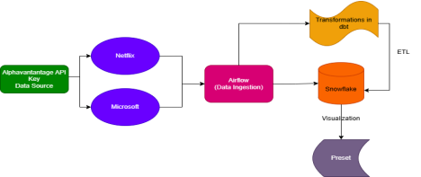
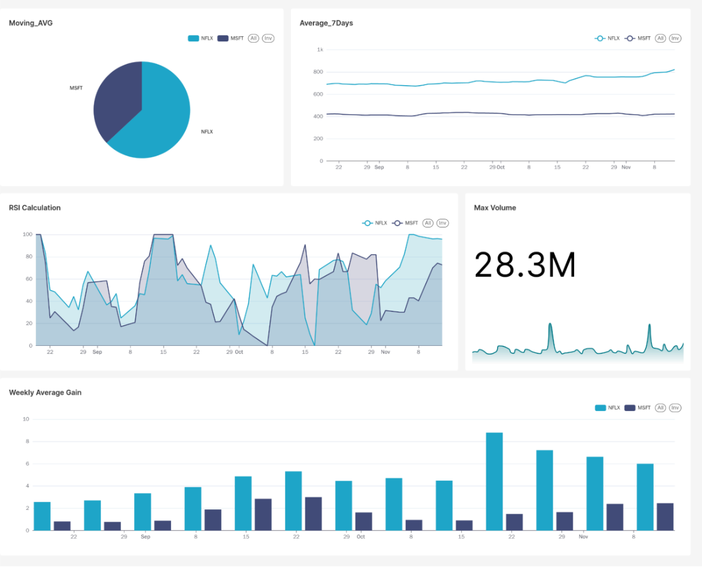

# 🚀 Automated Financial Analytics Platform

A sophisticated, production-grade data platform that automates the entire lifecycle of financial data—from real-time ingestion and machine learning forecasting to transformation, quality testing, and interactive visualization.

**✨ Live Dashboard: [View the Interactive Preset Dashboard](https://b9571882.us1a.app.preset.io/superset/dashboard/p/MJvpOj3reoP/)**

---

## 📖 The Story

In the fast-paced world of finance, having a timely and reliable view of market trends is crucial. This project was built to solve that problem. It's a fully automated pipeline that ingests stock data for Netflix (NFLX) and Microsoft (MSFT), trains a forecasting model, enriches the data with technical indicators, and serves everything up on a live dashboard—all without any manual intervention.

It demonstrates a modern **ELT (Extract, Load, Transform)** architecture, showcasing the powerful combination of **Airflow, dbt, Snowflake, and Preset.**

---

## ⚙️ How It Works: The Architecture



The system is built on a series of automated workflows that run daily:

1.  **📥 Data Ingestion & ML Forecasting (Airflow):**
    *   A dedicated Airflow DAG fetches the last 90 days of stock data from the **Alpha Vantage API**.
    *   It loads this raw data into **Snowflake**, ensuring no duplicates.
    *   A second DAG triggers the training of a **Snowflake ML forecasting model** to predict stock prices for the next 7 days.

2.  **🔄 Data Transformation & Quality (dbt + Airflow):**
    *   A separate Airflow DAG executes the `dbt run` command, which builds our data models inside Snowflake. This is where we calculate advanced financial metrics like:
        *   **7-Day Moving Average:** Smooths out short-term price fluctuations to identify trends.
        *   **14-Day RSI (Relative Strength Index):** A momentum indicator to identify overbought or oversold conditions.
    *   Another DAG runs `dbt test` to validate data quality and `dbt snapshot` to maintain a historical record of data changes (Slowly Changing Dimensions Type 2).

3.  **📊 Visualization & Insight (Preset):**
    *   Transformed data is visualized in an interactive **Preset (Apache Superset)** dashboard.
    *   Analysts can explore trends, filter by date, and use indicators like RSI to make informed decisions.

---

## 🛠️ Tech Stack

| Component           | Technology                                                          |
| ------------------- | ------------------------------------------------------------------- |
| **Orchestration**   | Apache Airflow                                                      |
| **Data Warehouse**  | Snowflake                                                           |
| **Transformation**  | dbt (data build tool)                                               |
| **Visualization**   | Preset (Apache Superset)                                            |
| **Data Source**     | Alpha Vantage API                                                   |
| **Language**        | SQL, Python                                                         |
| **Infrastructure**  | Docker                                                              |

---

## 🚀 Local Deployment with Docker

This project includes a `docker-compose.yml` file to get the entire environment running on your machine with one command.

**Prerequisites:** Docker and Docker Compose installed.

1.  **Clone the repository:**
    ```bash
    git clone https://github.com/Aayushi2504/Automated-Stock-Analysis-Pipeline.git
    cd Automated-Stock-Analysis-Pipeline
    ```

2.  **Configure Environment Variables:**
    Create a `.env` file in the root directory and add your secrets (get these from Alpha Vantage and Snowflake):
    ```bash
    ALPHA_VANTAGE_API_KEY=your_api_key_here
    SNOWFLAKE_ACCOUNT=your_account_here
    SNOWFLAKE_USER=your_username_here
    SNOWFLAKE_PASSWORD=your_password_here
    SNOWFLAKE_WAREHOUSE=COMPUTE_WH
    SNOWFLAKE_DATABASE=STOCK_DB
    SNOWFLAKE_SCHEMA=RAW
    ```

3.  **Launch the Platform:**
    ```bash
    docker-compose up -d
    ```
    This will start Airflow and all dependent services.

4.  **Access the Tools:**
    *   **Airflow UI:** Open `http://localhost:8080` (Login: `airflow` / `airflow`)
    *   **Trigger the DAGs:** Unpause and trigger the DAGs from the Airflow UI to run the pipeline.

---

## 📊 Project Outputs

### Preset Dashboard
The final dashboard provides actionable insights into stock performance:
*   **Trend Analysis:** Interactive line charts for Moving Averages and RSI over time.
*   **Performance Tracking:** Bar charts for weekly average gains.
*   **Key Metrics:** KPI widgets for metrics like Max Volume.
*   **Filters:** Dynamically filter by date and stock symbol.



### Key Data Models Created (in Snowflake)
*   `raw_data.stock_prices`: Raw ingested data.
*   `analytics.moving_average`: Table with the 7-day moving average.
*   `analytics.rsi_calculation`: Table with the RSI indicator.
*   `snapshots.stock_snapshot`: Historical snapshot of data changes.

---

## 📈 Impact & Results

- **100% Automation:** Eliminated manual data collection and reporting.
- **Data Quality:** Implemented automated testing (`dbt test`) to ensure reliability.
- **Historical Tracking:** Enabled point-in-time analysis with `dbt snapshots`.
- **Informed Decision-Making:** Provided analysts with a single source of truth for key financial indicators.

---

## 🔮 Future Enhancements

*   Integrate real-time news sentiment analysis to correlate with price movements.
*   Add more predictive models (e.g., LSTM networks) for higher accuracy forecasts.
*   Expand the dashboard to include predictive analytics and alerting.
*   Scale the pipeline to include hundreds of stocks.

---

## 👩‍💻 Author

**Aayushi Shah**
- [LinkedIn](https://www.linkedin.com/in/your-profile/)
- [GitHub](https://github.com/Aayushi2504)

*Master of Science in Data Science @ San Jose State University*
